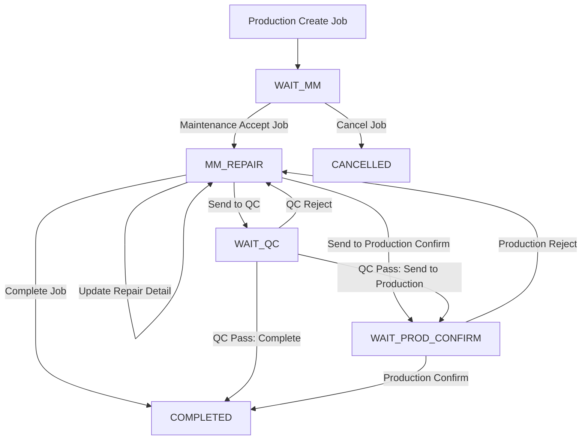

# Job Request Maintenance Flow Requirement

## 1. Document Overview

เอกสารนี้อธิบาย Flow การทำงานของระบบ **Job Request Maintenance** โดยมีผู้ใช้งานหลัก 3 Section คือ

1. Production
2. Maintenance
3. QC

ระบบใช้สำหรับให้ Production แจ้งซ่อมไปยัง Maintenance และ Maintenance สามารถส่งงานต่อให้ QC ตรวจสอบ หรือส่งกลับให้ Production Confirm ได้

ระบบต้องรองรับ

- การเปลี่ยนสถานะงานตาม Workflow
- การตีกลับงานจาก QC หรือ Production
- การวน Loop กลับไป Maintenance เพื่อแก้ไขงาน
- การบันทึกผู้รับงาน
- การแนบรูปภาพ
- การจำกัดสิทธิ์ตาม Section
- การแจ้งเตือนแบบ Real-time ผ่าน Socket.IO

---

## 2. Main Sections

ระบบมีหน้าหลักทั้งหมด 3 หน้า

| Page | Description |
|---|---|
| Production | ใช้สำหรับสร้าง Job Request, ติดตามงาน, Confirm หรือ Reject งาน |
| Maintenance | ใช้สำหรับรับงาน, ซ่อมงาน, ส่ง QC, ส่ง Production Confirm หรือปิดงาน |
| QC | ใช้สำหรับตรวจสอบงานหลัง Maintenance ซ่อมเสร็จ และ Pass หรือ Reject งาน |

---

## 3. User Roles

| Role | Description |
|---|---|
| Production User | ผู้ใช้งานฝ่าย Production |
| Maintenance User | ผู้ใช้งานฝ่าย Maintenance |
| QC User | ผู้ใช้งานฝ่าย QC |
| Production Admin | Admin ของ Production เข้าได้เฉพาะหน้า Production |
| Maintenance Admin | Admin ของ Maintenance เข้าได้เฉพาะหน้า Maintenance |
| QC Admin | Admin ของ QC เข้าได้เฉพาะหน้า QC |

---

## 4. Status List

ระบบควรใช้ Status หลักดังนี้

| Status | Description | Current Owner |
|---|---|---|
| `WAIT_MM` | รอ Maintenance รับงาน | Maintenance |
| `MM_REPAIR` | Maintenance รับงานแล้ว / อยู่ระหว่างซ่อม | Maintenance |
| `WAIT_QC` | รอ QC ตรวจสอบงานหลังซ่อม | QC |
| `WAIT_PROD_CONFIRM` | รอ Production Confirm งานหลังซ่อม | Production |
| `COMPLETED` | งานเสร็จสมบูรณ์ | End |
| `CANCELLED` | งานถูกยกเลิก | End |

---

## 5. Important Status Design

ระบบไม่จำเป็นต้องใช้ `REJECTED_BY_QC` หรือ `REJECTED_BY_PROD` เป็น Status หลัก

แนะนำให้เก็บ Reject เป็น Action ใน History Log แทน เพราะเมื่องานถูก Reject แล้ว สถานะจริงของงานควรกลับไปที่

```text
MM_REPAIR
```

ตัวอย่าง

| Action | From Status | To Status |
|---|---|---|
| QC Reject | `WAIT_QC` | `MM_REPAIR` |
| Production Reject | `WAIT_PROD_CONFIRM` | `MM_REPAIR` |

เหตุผล:

- ทำให้ Flow ง่าย
- Maintenance เห็นงานที่ต้องแก้ไขทันที
- รองรับการวน Loop ได้ง่าย
- สามารถดูประวัติการ Reject ได้จาก History Log

---

## 6. Main Workflow Summary

```text
Production Create Job
        ↓
WAIT_MM
        ↓
Maintenance Accept Job
        ↓
MM_REPAIR
        ↓
Maintenance Repair
        ↓
Maintenance Select Next Step
        ├── Send to QC
        │       ↓
        │   WAIT_QC
        │       ↓
        │   QC Pass / QC Reject
        │
        ├── Send to Production Confirm
        │       ↓
        │   WAIT_PROD_CONFIRM
        │       ↓
        │   Production Confirm / Production Reject
        │
        └── Completed
                ↓
            COMPLETED
```

---

# 7. Detailed Flow

---

## 7.1 Flow 1: Production Create Job Request

### Actor

Production

### Description

Production สร้างใบแจ้งซ่อมเมื่อพบปัญหาเครื่องจักรหรืออุปกรณ์

### Required Input

| Field | Required | Description |
|---|---:|---|
| Machine Name | Yes | ชื่อเครื่องจักร |
| Machine Code | Optional | รหัสเครื่องจักร |
| Production Line | Yes | ไลน์ผลิต |
| Area | Optional | พื้นที่ติดตั้งเครื่อง |
| Problem Description | Yes | รายละเอียดปัญหา |
| Priority | Yes | ความเร่งด่วน |
| Request By | Auto | ผู้สร้าง Job จาก Login |
| Attachment Images | Optional | รูปภาพปัญหา |

### Action

```text
Production submit job request
```

### Status Change

```text
- → WAIT_MM
```

### System Process

```text
1. Generate Job No.
2. Save job request data.
3. Set requestBy = current login user.
4. Set status = WAIT_MM.
5. Save createdAt.
6. Save updatedAt.
7. Send real-time notification to Maintenance.
8. Add history log.
```

### History Log

| Action | From Status | To Status | By |
|---|---|---|---|
| CREATE_JOB | - | `WAIT_MM` | Production User |

### Socket.IO Event

| Event | From | To |
|---|---|---|
| `new_job_request` | Production | Maintenance |

---

## 7.2 Flow 2: Maintenance Accept Job

### Actor

Maintenance

### Description

Maintenance เห็นงานที่ Production แจ้งเข้ามา และกดรับงาน

### Condition

งานต้องอยู่ในสถานะ

```text
WAIT_MM
```

### Action

```text
Maintenance click Accept Job
```

### Required System Record

| Field | Description |
|---|---|
| maintenancePic | ผู้รับผิดชอบงาน |
| acceptBy | ผู้กดรับงาน |
| acceptAt | วันเวลาที่รับงาน |

### Status Change

```text
WAIT_MM → MM_REPAIR
```

### System Process

```text
1. Validate current status = WAIT_MM.
2. Check maintenancePic is empty.
3. Set maintenancePic = current login user.
4. Set acceptBy = current login user.
5. Set acceptAt = current date time.
6. Set status = MM_REPAIR.
7. Save updatedAt.
8. Send real-time notification to Production.
9. Add history log.
```

### Important Rule

ห้ามรับงานซ้ำ ถ้ามี Maintenance รับงานไปแล้ว

```text
If maintenancePic is not empty,
system must block Accept Job action.
```

### History Log

| Action | From Status | To Status | By |
|---|---|---|---|
| ACCEPT_JOB | `WAIT_MM` | `MM_REPAIR` | Maintenance User |

### Socket.IO Event

| Event | From | To |
|---|---|---|
| `job_accepted` | Maintenance | Production |

---

## 7.3 Flow 3: Maintenance Repair Job

### Actor

Maintenance

### Description

Maintenance ดำเนินการซ่อมและบันทึกรายละเอียดงานซ่อม

### Condition

งานต้องอยู่ในสถานะ

```text
MM_REPAIR
```

### Repair Input

| Field | Required | Description |
|---|---:|---|
| Repair Detail | Yes | รายละเอียดการซ่อม |
| Cause of Problem | Optional | สาเหตุของปัญหา |
| Corrective Action | Optional | วิธีแก้ไข |
| Spare Part Used | Optional | อะไหล่ที่ใช้ |
| Repair Start Time | Optional | เวลาเริ่มซ่อม |
| Repair Finish Time | Optional | เวลาซ่อมเสร็จ |
| Attachment Images | Optional | รูประหว่างซ่อมหรือหลังซ่อม |
| Remark | Optional | หมายเหตุ |

### Status Change

```text
MM_REPAIR → MM_REPAIR
```

### System Process

```text
1. Validate current status = MM_REPAIR.
2. Save repair detail.
3. Save attachment images if any.
4. Save updatedAt.
5. Add history log.
```

### History Log

| Action | From Status | To Status | By |
|---|---|---|---|
| UPDATE_REPAIR | `MM_REPAIR` | `MM_REPAIR` | Maintenance User |

---

## 7.4 Flow 4: Maintenance Finish Repair

หลังจาก Maintenance ซ่อมเสร็จ ระบบต้องให้เลือก Next Step ได้ 3 ทาง

1. Send to QC
2. Send to Production Confirm
3. Complete Job

---

# 8. Maintenance Next Step Options

---

## 8.1 Option 1: Send to QC

### Actor

Maintenance

### Description

Maintenance ส่งงานให้ QC ตรวจสอบหลังซ่อม

### Condition

งานต้องอยู่ในสถานะ

```text
MM_REPAIR
```

และควรมี Repair Detail แล้ว

### Action

```text
Maintenance click Send to QC
```

### Status Change

```text
MM_REPAIR → WAIT_QC
```

### System Process

```text
1. Validate current status = MM_REPAIR.
2. Validate repair detail is not empty.
3. Set status = WAIT_QC.
4. Set sentToQcBy = current login user.
5. Set sentToQcAt = current date time.
6. Save updatedAt.
7. Send real-time notification to QC.
8. Add history log.
```

### History Log

| Action | From Status | To Status | By |
|---|---|---|---|
| SEND_TO_QC | `MM_REPAIR` | `WAIT_QC` | Maintenance User |

### Socket.IO Event

| Event | From | To |
|---|---|---|
| `job_wait_qc` | Maintenance | QC |

---

## 8.2 Option 2: Send to Production Confirm

### Actor

Maintenance

### Description

Maintenance ส่งงานให้ Production ตรวจสอบและยืนยันผลหลังซ่อม

### Condition

งานต้องอยู่ในสถานะ

```text
MM_REPAIR
```

และควรมี Repair Detail แล้ว

### Action

```text
Maintenance click Send to Production Confirm
```

### Status Change

```text
MM_REPAIR → WAIT_PROD_CONFIRM
```

### System Process

```text
1. Validate current status = MM_REPAIR.
2. Validate repair detail is not empty.
3. Set status = WAIT_PROD_CONFIRM.
4. Set sentToProductionBy = current login user.
5. Set sentToProductionAt = current date time.
6. Save updatedAt.
7. Send real-time notification to Production.
8. Add history log.
```

### History Log

| Action | From Status | To Status | By |
|---|---|---|---|
| SEND_TO_PRODUCTION | `MM_REPAIR` | `WAIT_PROD_CONFIRM` | Maintenance User |

### Socket.IO Event

| Event | From | To |
|---|---|---|
| `job_wait_confirming` | Maintenance | Production |

---

## 8.3 Option 3: Complete Job by Maintenance

### Actor

Maintenance

### Description

Maintenance ปิดงานทันที โดยไม่ส่ง QC และไม่ส่ง Production Confirm

### Condition

งานต้องอยู่ในสถานะ

```text
MM_REPAIR
```

และต้องมี Repair Detail แล้ว

### Action

```text
Maintenance click Complete Job
```

### Status Change

```text
MM_REPAIR → COMPLETED
```

### System Process

```text
1. Validate current status = MM_REPAIR.
2. Validate repair detail is not empty.
3. Set status = COMPLETED.
4. Set completedBy = current login user.
5. Set completedAt = current date time.
6. Save updatedAt.
7. Send real-time notification to Production.
8. Add history log.
```

### History Log

| Action | From Status | To Status | By |
|---|---|---|---|
| COMPLETE_JOB | `MM_REPAIR` | `COMPLETED` | Maintenance User |

### Socket.IO Event

| Event | From | To |
|---|---|---|
| `job_completed` | Maintenance | Production |

---

# 9. QC Flow

---

## 9.1 QC Job List

### Actor

QC

### Description

QC เห็นรายการงานที่ Maintenance ส่งมาให้ตรวจสอบ

### Visible Status

```text
WAIT_QC
```

QC ควรเห็นเฉพาะงานที่อยู่ในสถานะ `WAIT_QC`

---

## 9.2 QC Inspection

QC สามารถเลือกได้ 2 ทางหลัก

1. QC Pass
2. QC Reject

---

## 9.3 QC Pass and Send to Production Confirm

### Actor

QC

### Description

QC ตรวจสอบผ่าน และส่งงานต่อให้ Production Confirm

### Condition

งานต้องอยู่ในสถานะ

```text
WAIT_QC
```

### Action

```text
QC click Pass & Send to Production
```

### Status Change

```text
WAIT_QC → WAIT_PROD_CONFIRM
```

### System Process

```text
1. Validate current status = WAIT_QC.
2. Set qcStatus = PASS.
3. Set qcBy = current login user.
4. Set qcCheckedAt = current date time.
5. Set status = WAIT_PROD_CONFIRM.
6. Save updatedAt.
7. Send real-time notification to Production.
8. Add history log.
```

### History Log

| Action | From Status | To Status | By |
|---|---|---|---|
| QC_PASS_SEND_TO_PRODUCTION | `WAIT_QC` | `WAIT_PROD_CONFIRM` | QC User |

### Socket.IO Event

| Event | From | To |
|---|---|---|
| `job_wait_confirming` | QC | Production |

---

## 9.4 QC Pass and Complete

### Actor

QC

### Description

QC ตรวจสอบผ่าน และปิดงานทันที

### Condition

งานต้องอยู่ในสถานะ

```text
WAIT_QC
```

### Action

```text
QC click Pass & Complete
```

### Status Change

```text
WAIT_QC → COMPLETED
```

### System Process

```text
1. Validate current status = WAIT_QC.
2. Set qcStatus = PASS.
3. Set qcBy = current login user.
4. Set qcCheckedAt = current date time.
5. Set status = COMPLETED.
6. Set completedBy = current login user.
7. Set completedAt = current date time.
8. Save updatedAt.
9. Send real-time notification to Maintenance and Production.
10. Add history log.
```

### History Log

| Action | From Status | To Status | By |
|---|---|---|---|
| QC_PASS_COMPLETE | `WAIT_QC` | `COMPLETED` | QC User |

### Socket.IO Event

| Event | From | To |
|---|---|---|
| `job_completed` | QC | Maintenance, Production |

---

## 9.5 QC Reject to Maintenance

### Actor

QC

### Description

QC ตรวจสอบไม่ผ่าน และตีกลับไปให้ Maintenance แก้ไข

### Condition

งานต้องอยู่ในสถานะ

```text
WAIT_QC
```

### Required Input

| Field | Required | Description |
|---|---:|---|
| QC Reject Reason | Yes | เหตุผลที่ QC ตีกลับ |
| Attachment Images | Optional | รูปภาพประกอบ |

### Action

```text
QC click Reject to Maintenance
```

### Status Change

```text
WAIT_QC → MM_REPAIR
```

### System Process

```text
1. Validate current status = WAIT_QC.
2. Validate qcRejectReason is not empty.
3. Set qcStatus = REJECT.
4. Set rejectFrom = QC.
5. Set rejectBy = current login user.
6. Set rejectReason = qcRejectReason.
7. Set status = MM_REPAIR.
8. Save attachment images if any.
9. Save updatedAt.
10. Send real-time notification to Maintenance.
11. Add history log.
```

### History Log

| Action | From Status | To Status | By |
|---|---|---|---|
| QC_REJECT | `WAIT_QC` | `MM_REPAIR` | QC User |

### Socket.IO Event

| Event | From | To |
|---|---|---|
| `job_rejected_by_qc` | QC | Maintenance |

---

# 10. Production Confirm Flow

---

## 10.1 Production Confirm Job List

### Actor

Production

### Description

Production เห็นงานที่รอการ Confirm หลังซ่อม

### Visible Status

```text
WAIT_PROD_CONFIRM
```

Production ควรเห็นงานที่เกี่ยวข้องกับ Production Line หรือ Section ของตัวเอง

---

## 10.2 Production Confirm

### Actor

Production

### Description

Production ตรวจสอบงานแล้วพบว่าใช้งานได้ปกติ และกดยืนยันปิดงาน

### Condition

งานต้องอยู่ในสถานะ

```text
WAIT_PROD_CONFIRM
```

### Action

```text
Production click Confirm Job
```

### Status Change

```text
WAIT_PROD_CONFIRM → COMPLETED
```

### System Process

```text
1. Validate current status = WAIT_PROD_CONFIRM.
2. Set productionConfirmStatus = CONFIRM.
3. Set productionConfirmBy = current login user.
4. Set productionConfirmAt = current date time.
5. Set status = COMPLETED.
6. Set completedBy = current login user.
7. Set completedAt = current date time.
8. Save updatedAt.
9. Send real-time notification to Maintenance.
10. Send real-time notification to QC if job passed QC before.
11. Add history log.
```

### History Log

| Action | From Status | To Status | By |
|---|---|---|---|
| PRODUCTION_CONFIRM | `WAIT_PROD_CONFIRM` | `COMPLETED` | Production User |

### Socket.IO Event

| Event | From | To |
|---|---|---|
| `job_completed` | Production | Maintenance, QC if related |

---

## 10.3 Production Reject to Maintenance

### Actor

Production

### Description

Production ตรวจสอบแล้วพบว่างานยังไม่เรียบร้อย และตีกลับไปให้ Maintenance แก้ไข

### Condition

งานต้องอยู่ในสถานะ

```text
WAIT_PROD_CONFIRM
```

### Required Input

| Field | Required | Description |
|---|---:|---|
| Production Reject Reason | Yes | เหตุผลที่ Production ตีกลับ |
| Attachment Images | Optional | รูปภาพประกอบ |

### Action

```text
Production click Reject to Maintenance
```

### Status Change

```text
WAIT_PROD_CONFIRM → MM_REPAIR
```

### System Process

```text
1. Validate current status = WAIT_PROD_CONFIRM.
2. Validate productionRejectReason is not empty.
3. Set productionConfirmStatus = REJECT.
4. Set rejectFrom = Production.
5. Set rejectBy = current login user.
6. Set rejectReason = productionRejectReason.
7. Set status = MM_REPAIR.
8. Save attachment images if any.
9. Save updatedAt.
10. Send real-time notification to Maintenance.
11. Add history log.
```

### History Log

| Action | From Status | To Status | By |
|---|---|---|---|
| PRODUCTION_REJECT | `WAIT_PROD_CONFIRM` | `MM_REPAIR` | Production User |

### Socket.IO Event

| Event | From | To |
|---|---|---|
| `job_rejected_by_production` | Production | Maintenance |

---

# 11. Loop Flow

ระบบต้องรองรับการตีกลับและวนกลับไปซ่อมใหม่ได้หลายรอบ

---

## 11.1 QC Reject Loop

```text
MM_REPAIR
    ↓
Maintenance Send to QC
    ↓
WAIT_QC
    ↓
QC Reject
    ↓
MM_REPAIR
    ↓
Maintenance Repair Again
    ↓
Maintenance Send to QC Again
    ↓
WAIT_QC
    ↓
QC Pass
```

### Status Table

| Step | Action | Status |
|---:|---|---|
| 1 | Maintenance repair | `MM_REPAIR` |
| 2 | Send to QC | `WAIT_QC` |
| 3 | QC Reject | `MM_REPAIR` |
| 4 | Maintenance repair again | `MM_REPAIR` |
| 5 | Send to QC again | `WAIT_QC` |
| 6 | QC Pass | `WAIT_PROD_CONFIRM` or `COMPLETED` |

---

## 11.2 Production Reject Loop

```text
MM_REPAIR
    ↓
Maintenance Send to Production Confirm
    ↓
WAIT_PROD_CONFIRM
    ↓
Production Reject
    ↓
MM_REPAIR
    ↓
Maintenance Repair Again
    ↓
Maintenance Send to Production Confirm Again
    ↓
WAIT_PROD_CONFIRM
    ↓
Production Confirm
    ↓
COMPLETED
```

### Status Table

| Step | Action | Status |
|---:|---|---|
| 1 | Maintenance repair | `MM_REPAIR` |
| 2 | Send to Production Confirm | `WAIT_PROD_CONFIRM` |
| 3 | Production Reject | `MM_REPAIR` |
| 4 | Maintenance repair again | `MM_REPAIR` |
| 5 | Send to Production Confirm again | `WAIT_PROD_CONFIRM` |
| 6 | Production Confirm | `COMPLETED` |

---

## 11.3 Full Loop with QC and Production Reject

```text
Production Create Job
    ↓
WAIT_MM
    ↓
Maintenance Accept
    ↓
MM_REPAIR
    ↓
Send to QC
    ↓
WAIT_QC
    ↓
QC Reject
    ↓
MM_REPAIR
    ↓
Send to QC Again
    ↓
WAIT_QC
    ↓
QC Pass
    ↓
WAIT_PROD_CONFIRM
    ↓
Production Reject
    ↓
MM_REPAIR
    ↓
Send to Production Again
    ↓
WAIT_PROD_CONFIRM
    ↓
Production Confirm
    ↓
COMPLETED
```

---

# 12. Status Transition Table

ตารางนี้ใช้เป็นกฎหลักสำหรับ Developer

| Current Status | Action | Next Status | Action By |
|---|---|---|---|
| - | `CREATE_JOB` | `WAIT_MM` | Production |
| `WAIT_MM` | `ACCEPT_JOB` | `MM_REPAIR` | Maintenance |
| `MM_REPAIR` | `UPDATE_REPAIR` | `MM_REPAIR` | Maintenance |
| `MM_REPAIR` | `SEND_TO_QC` | `WAIT_QC` | Maintenance |
| `MM_REPAIR` | `SEND_TO_PRODUCTION` | `WAIT_PROD_CONFIRM` | Maintenance |
| `MM_REPAIR` | `COMPLETE_JOB` | `COMPLETED` | Maintenance |
| `WAIT_QC` | `QC_PASS_SEND_TO_PRODUCTION` | `WAIT_PROD_CONFIRM` | QC |
| `WAIT_QC` | `QC_PASS_COMPLETE` | `COMPLETED` | QC |
| `WAIT_QC` | `QC_REJECT` | `MM_REPAIR` | QC |
| `WAIT_PROD_CONFIRM` | `PRODUCTION_CONFIRM` | `COMPLETED` | Production |
| `WAIT_PROD_CONFIRM` | `PRODUCTION_REJECT` | `MM_REPAIR` | Production |
| `WAIT_MM` | `CANCEL_JOB` | `CANCELLED` | Production / Admin |

---

# 13. Permission by Status

---

## 13.1 Production Page Permission

| Status | Available Action |
|---|---|
| `WAIT_MM` | View, Cancel |
| `MM_REPAIR` | View |
| `WAIT_QC` | View |
| `WAIT_PROD_CONFIRM` | Confirm, Reject |
| `COMPLETED` | View |
| `CANCELLED` | View |

---

## 13.2 Maintenance Page Permission

| Status | Available Action |
|---|---|
| `WAIT_MM` | Accept Job |
| `MM_REPAIR` | Update Repair, Send to QC, Send to Production, Complete |
| `WAIT_QC` | View |
| `WAIT_PROD_CONFIRM` | View |
| `COMPLETED` | View |
| `CANCELLED` | View |

---

## 13.3 QC Page Permission

| Status | Available Action |
|---|---|
| `WAIT_MM` | No Action |
| `MM_REPAIR` | No Action |
| `WAIT_QC` | QC Pass, QC Reject |
| `WAIT_PROD_CONFIRM` | View |
| `COMPLETED` | View |
| `CANCELLED` | View |

---

# 14. Section Access Control

ถ้า Login ด้วย Admin หรือ User ของ Section ใด ให้เข้าได้เฉพาะหน้าของ Section นั้น

| Login Role | Production Page | Maintenance Page | QC Page |
|---|---|---|---|
| Production User | Yes | No | No |
| Maintenance User | No | Yes | No |
| QC User | No | No | Yes |
| Production Admin | Yes | No | No |
| Maintenance Admin | No | Yes | No |
| QC Admin | No | No | Yes |

---

# 15. Attachment Requirement

ระบบต้องสามารถแนบรูปภาพได้ในขั้นตอนต่อไปนี้

| Step | Attachment |
|---|---|
| Production Create Job | Optional |
| Maintenance Repair | Optional |
| Maintenance Complete Job | Optional |
| QC Reject | Optional |
| Production Reject | Optional |
| Production Confirm | Optional |

## Attachment Rules

- รองรับไฟล์ JPG, JPEG, PNG
- แนบได้หลายรูป
- แสดง Preview ได้
- กดดูรูปขนาดใหญ่ได้
- บันทึกชื่อผู้อัปโหลด
- บันทึกวันที่และเวลาอัปโหลด
- รูปต้องผูกกับ Job ID
- รูปควรแยกประเภทได้ เช่น Problem Image, Repair Image, Reject Image

---

# 16. History Log Requirement

ระบบต้องบันทึกประวัติทุกครั้งที่มีการเปลี่ยนสถานะหรือ Action สำคัญ

## Required Fields

| Field | Description |
|---|---|
| id | History ID |
| jobId | Job ID |
| action | Action ที่เกิดขึ้น |
| oldStatus | Status เดิม |
| newStatus | Status ใหม่ |
| actionBy | ผู้ทำรายการ |
| section | Section ของผู้ทำรายการ |
| remark | หมายเหตุ |
| rejectReason | เหตุผลการตีกลับ ถ้ามี |
| createdAt | วันที่และเวลาที่เกิด Action |

## Example History

| Time | Action | From Status | To Status | By |
|---|---|---|---|---|
| 2026-05-12 08:00 | CREATE_JOB | - | `WAIT_MM` | Production User |
| 2026-05-12 08:10 | ACCEPT_JOB | `WAIT_MM` | `MM_REPAIR` | Maintenance User |
| 2026-05-12 09:00 | SEND_TO_QC | `MM_REPAIR` | `WAIT_QC` | Maintenance User |
| 2026-05-12 09:30 | QC_REJECT | `WAIT_QC` | `MM_REPAIR` | QC User |
| 2026-05-12 10:20 | PRODUCTION_CONFIRM | `WAIT_PROD_CONFIRM` | `COMPLETED` | Production User |

---

# 17. Socket.IO Notification Requirement

ระบบต้องมีการแจ้งเตือนแบบ Real-time ผ่าน Socket.IO

---

## 17.1 Socket Rooms

แนะนำให้แบ่ง Room ตาม Section

```text
production_room
maintenance_room
qc_room
```

---

## 17.2 Socket Events

| Action | Event | From | To |
|---|---|---|---|
| Production Create Job | `new_job_request` | Production | Maintenance |
| Maintenance Accept Job | `job_accepted` | Maintenance | Production |
| Maintenance Send to QC | `job_wait_qc` | Maintenance | QC |
| Maintenance Send to Production | `job_wait_confirming` | Maintenance | Production |
| QC Reject | `job_rejected_by_qc` | QC | Maintenance |
| QC Pass Send to Production | `job_wait_confirming` | QC | Production |
| QC Pass Complete | `job_completed` | QC | Maintenance, Production |
| Production Reject | `job_rejected_by_production` | Production | Maintenance |
| Production Confirm | `job_completed` | Production | Maintenance, QC if related |
| Maintenance Complete | `job_completed` | Maintenance | Production |

---

## 17.3 Socket Payload Example

```json
{
  "jobId": "JOB-20260512-001",
  "jobNo": "JOB-20260512-001",
  "status": "WAIT_QC",
  "action": "SEND_TO_QC",
  "message": "Maintenance sent job to QC inspection",
  "fromSection": "Maintenance",
  "toSection": "QC",
  "updatedBy": "Maintenance User",
  "updatedAt": "2026-05-12 20:30:00"
}
```

---

# 18. Recommended Database Status Type

## Job Status

```ts
type JobStatus =
  | "WAIT_MM"
  | "MM_REPAIR"
  | "WAIT_QC"
  | "WAIT_PROD_CONFIRM"
  | "COMPLETED"
  | "CANCELLED";
```

## Job Action

```ts
type JobAction =
  | "CREATE_JOB"
  | "ACCEPT_JOB"
  | "UPDATE_REPAIR"
  | "SEND_TO_QC"
  | "SEND_TO_PRODUCTION"
  | "QC_PASS_SEND_TO_PRODUCTION"
  | "QC_PASS_COMPLETE"
  | "QC_REJECT"
  | "PRODUCTION_CONFIRM"
  | "PRODUCTION_REJECT"
  | "COMPLETE_JOB"
  | "CANCEL_JOB";
```

---

# 19. Mermaid Flow Diagram

สามารถนำ Diagram นี้ไปใส่ใน Markdown ที่รองรับ Mermaid ได้



---

# 20. Validation Rules

---

## 20.1 Create Job Validation

Production ต้องกรอกข้อมูลอย่างน้อย

- Machine Name
- Production Line
- Problem Description
- Priority

ถ้าไม่ครบ ห้ามสร้าง Job

---

## 20.2 Accept Job Validation

ก่อน Maintenance กดรับงาน ระบบต้องตรวจสอบ

```text
currentStatus = WAIT_MM
maintenancePic is empty
```

ถ้างานมีคนรับแล้ว ห้ามรับซ้ำ

---

## 20.3 Send to QC Validation

ก่อนส่ง QC ต้องตรวจสอบ

```text
currentStatus = MM_REPAIR
repairDetail is not empty
```

---

## 20.4 Send to Production Confirm Validation

ก่อนส่ง Production Confirm ต้องตรวจสอบ

```text
currentStatus = MM_REPAIR
repairDetail is not empty
```

---

## 20.5 QC Reject Validation

ก่อน QC Reject ต้องตรวจสอบ

```text
currentStatus = WAIT_QC
qcRejectReason is not empty
```

---

## 20.6 Production Reject Validation

ก่อน Production Reject ต้องตรวจสอบ

```text
currentStatus = WAIT_PROD_CONFIRM
productionRejectReason is not empty
```

---

## 20.7 Complete Job Validation

ก่อนปิดงานต้องตรวจสอบ

```text
repairDetail is not empty
completedBy is not empty
completedAt is not empty
```

---

# 21. Basic API Requirement

| Method | Endpoint | Description |
|---|---|---|
| GET | `/api/jobs` | Get job list |
| GET | `/api/jobs/:id` | Get job detail |
| POST | `/api/jobs` | Create job request |
| PUT | `/api/jobs/:id/accept` | Maintenance accept job |
| PUT | `/api/jobs/:id/repair` | Update repair detail |
| PUT | `/api/jobs/:id/send-qc` | Send job to QC |
| PUT | `/api/jobs/:id/send-production` | Send job to Production Confirm |
| PUT | `/api/jobs/:id/qc-pass-send-production` | QC Pass and send to Production |
| PUT | `/api/jobs/:id/qc-pass-complete` | QC Pass and complete |
| PUT | `/api/jobs/:id/qc-reject` | QC reject |
| PUT | `/api/jobs/:id/production-confirm` | Production confirm |
| PUT | `/api/jobs/:id/production-reject` | Production reject |
| PUT | `/api/jobs/:id/complete` | Complete job |
| PUT | `/api/jobs/:id/cancel` | Cancel job |
| POST | `/api/jobs/:id/attachments` | Upload attachments |
| GET | `/api/jobs/:id/history` | Get job history |

---

# 22. Success Criteria

ระบบถือว่าสำเร็จเมื่อทำงานได้ตามนี้

- Production สร้าง Job Request ได้
- Job ใหม่มี Status เป็น `WAIT_MM`
- Maintenance ได้รับแจ้งเตือนแบบ Real-time
- Maintenance กดรับงานได้
- ระบบบันทึกผู้รับงานได้
- Maintenance บันทึกรายละเอียดการซ่อมได้
- Maintenance แนบรูปภาพได้
- Maintenance ส่งงานไป QC ได้
- Maintenance ส่งงานให้ Production Confirm ได้
- Maintenance ปิดงานเองได้
- QC ตรวจสอบและ Pass งานได้
- QC Reject งานกลับ Maintenance ได้
- Production Confirm งานได้
- Production Reject งานกลับ Maintenance ได้
- งานที่ถูก Reject ต้องกลับไป Status `MM_REPAIR`
- ระบบรองรับ Loop การ Reject ได้หลายรอบ
- ระบบเก็บ History Log ทุก Action สำคัญ
- User หรือ Admin เข้าได้เฉพาะหน้าของ Section ตัวเอง
- ระบบแจ้งเตือนผ่าน Socket.IO ได้แบบ Real-time

---

# 23. Version 1.0 Scope

Feature สำหรับ Version แรก

- Login แยก Role และ Section
- Production Create Job
- Maintenance Accept Job
- Maintenance Repair Job
- Maintenance Send to QC
- Maintenance Send to Production Confirm
- Maintenance Complete Job
- QC Pass
- QC Reject
- Production Confirm
- Production Reject
- Upload Image
- Job History
- Status Tracking
- Permission by Section
- Real-time Notification with Socket.IO
- Basic Job Dashboard
